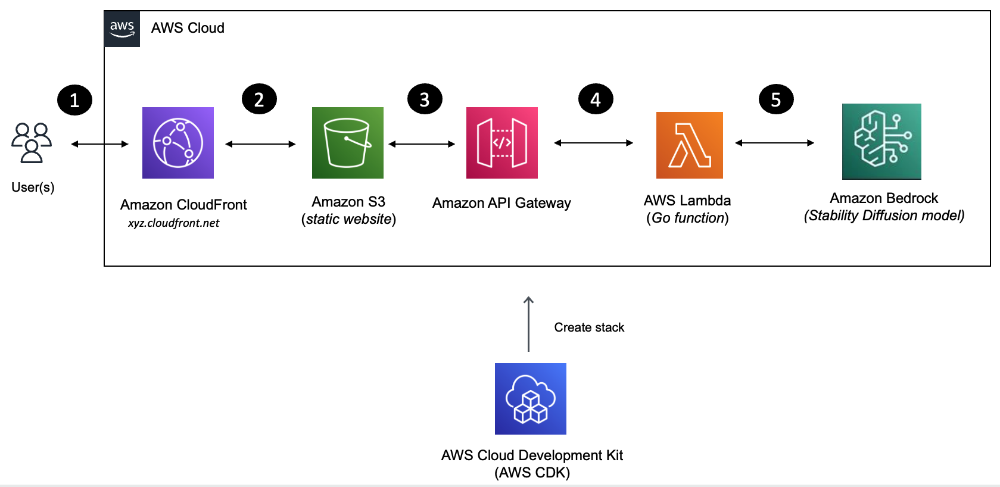
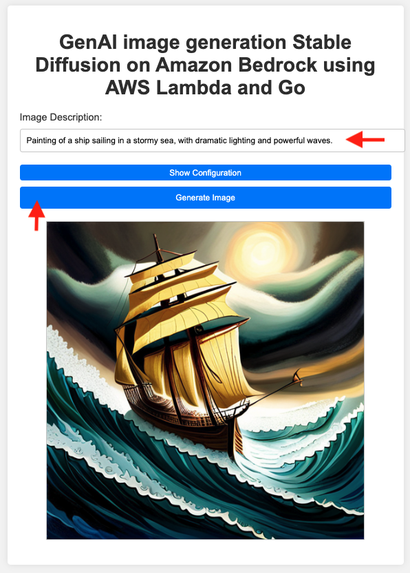

## Serverless image generation with Amazon Bedrock and AWS Lambda

[Amazon Bedrock](https://docs.aws.amazon.com/bedrock/latest/userguide/what-is-service.html/?sc_channel=el&sc_campaign=genaiwave&sc_content=amazon-bedrock-lambda-image-gen-website&sc_geo=mult&sc_country=mult&sc_outcome=acq) is a fully managed service that makes base models from Amazon and third-party model providers (such as Anthropic, Cohere, and more) accessible through an API.

Once the solution is deployed, users can access a static website hosted on [Amazon S3](https://docs.aws.amazon.com/AmazonS3/latest/userguide/Welcome.html/?sc_channel=el&sc_campaign=genaiwave&sc_content=amazon-bedrock-lambda-image-gen-website&sc_geo=mult&sc_country=mult&sc_outcome=acq) via [Amazon CloudFront](https://docs.aws.amazon.com/AmazonCloudFront/latest/DeveloperGuide/Introduction.html/?sc_channel=el&sc_campaign=genaiwave&sc_content=amazon-bedrock-lambda-image-gen-website&sc_geo=mult&sc_country=mult&sc_outcome=acq) domain. They can enter the image description which will be passed on to a Lambda function (via [Amazon API Gateway](https://docs.aws.amazon.com/apigateway/latest/developerguide/welcome.html/?sc_channel=el&sc_campaign=genaiwave&sc_content=amazon-bedrock-lambda-image-gen-website&sc_geo=mult&sc_country=mult&sc_outcome=acq)) which in turn will invoke [Stable Diffusion model on Amazon Bedrock](https://docs.aws.amazon.com/bedrock/latest/userguide/what-is-service.html#models-supported/?sc_channel=el&sc_campaign=genaiwave&sc_content=amazon-bedrock-lambda-image-gen-website&sc_geo=mult&sc_country=mult&sc_outcome=acq) to generate the image.

## Security

See [CONTRIBUTING](CONTRIBUTING.md#security-issue-notifications) for more information.

## License

This library is licensed under the MIT-0 License. See the LICENSE file.

